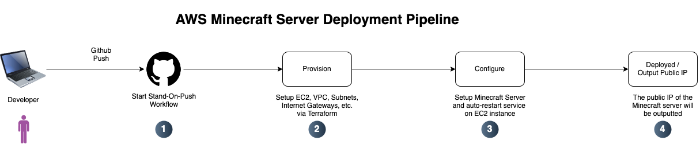

# Automated AWS Minecraft Server Deployment:
This project demonstrates how to fully automate the provisioning and configuration of a Minecraft server on AWS using Terraform, Ansible, and GitHub Actions. The infrastructure is codified and version-controlled, enabling reliable, repeatable deployments.

## Requirements:
To follow this tutorial or reuse this project, you’ll need:

* An AWS account with permissions to manage EC2, VPC, IAM, and S3.
* A GitHub repository to store and trigger your deployment pipeline (you can fork this repository).
* Basic knowledge of Terraform, Ansible, and GitHub Actions.

### Required Tools:
Install/Setup the following tools locally if you intend to test or deploy manually:

* Terraform (v1.5 or higher)
* Ansible (v2.10+)
* AWS CLI
* Python 3 (for Ansible compatibility)
* ssh (to connect to EC2 if needed)

### Actions/Github Environment Setup:
To automate deployments, GitHub Actions is used as a CI/CD pipeline:

1. Set the following secrets in your GitHub repository under Settings > Secrets > Actions:

    * `AWS_ACCESS_KEY_ID`
    * `AWS_SECRET_ACCESS_KEY`
    * `AWS_SECRET_SESSION_TOKEN` (**Optional** - Depends on your AWS auth)
    * `AWS_REGION`

2. A GitHub Actions workflow (.github/workflows/stand-on-push.yml) triggers on every push to the main branch. It:

    * Initializes Terraform
    * Provisions infrastructure
    * Runs Ansible over SSH to configure the minecraft server

### Configuring AWS Credentials & Remote Terraform State:
Terraform supports remote backends which allow you to store your state file securely in a S3 bucket. You can see the configuration for this in the `terraform.tf` file with the backend setup as the following:

```
terraform {
  backend "s3" {
    bucket = "riceri-terraform-state-bucket"
    key    = "minecraft/terraform.tfstate"
    region = "us-west-2"
    encrypt = true
  }

  required_providers {
    aws = {
      source  = "hashicorp/aws"
      version = "~> 4.16"
    }
  }

  required_version = ">= 1.2.0"
}
```

You need to make sure that you have an S3 bucket setup and that it is named and referenced correctly in this backend section. There is another terraform file in the `terraform-state-storage` folder which codifies this process although you will have to do a manual startup with no explicit backend on the first apply.

The reason this is needed is so that the Actions pipelines can always know and reference the current state of the infrastructure. Without this you would risk not properly destroying unused infrastructure and creating duplicated setups which can break the minecraft server and waste unneeded AWS resources.

Finally, you need to make sure that you have the correct AWS credentials setup and that they are configured in the repository in order for any of this to work as the S3 bucket won't be able to be referenced without those credentials. Refer to the **Actions/Github Environment Setup** section for more info.

## Automated Actions Deployment Pipeline:
The deployment pipeline for this automated minecraft server hosted via AWS runs with the following steps:

1. Initializes Terraform
2. Provisions infrastructure
3. Runs Ansible over SSH to configure the minecraft server
4. Outputs Minecraft servers public IP

And is triggered to run on every push to the github repository. Refer to the diagram for more info.

### Diagram:


## Manual Deployment / Local Testing:
> ⚠️ **Prerequisite: AWS Credentials:**
>
> Ensure your AWS credentials are correctly configured on your local machine. You can do this by setting up your `~/.aws/credentials` file using the AWS CLI, which should look something like this:
> ```
> [default]
> aws_access_key_id = YOUR_ACCESS_KEY_ID
> aws_secret_access_key = YOUR_SECRET_ACCESS_KEY
> aws_secret_session_token = YOUR_SECRET_SESSION_TOKEN (OPTIONAL)
> region = YOUR_REGION
> ```

---

If you'd like to manually deploy the Minecraft server from your local machine—for testing, debugging, or development purposes—follow these steps:

### 1. Provision Infrastructure with Terraform:

Navigate to the `terraform` directory:
```
cd terraform
```

Then run the following commands:
```
terraform init
terraform validate
terraform plan -var 'key_path=path/to/your/public/key.pub'
terraform apply -var 'key_path=path/to/your/public/key.pub' -auto-approve
```
**Note:** The `key_path` var should point to the public key associated with the private SSH key you plan to use to connect to the EC2 instance.

### 2. Configure Ansible:

Next, switch to the `ansible` directory:
```
# if in root directory
cd ansible

# if in terraform directory
cd ../ansible
```

Create a valid ansible inventory file called `inventory.ini` for our EC2 instance with the following commands:
```
# create inventory file
touch inventory.ini

# add EC2 instance to the ansible inventory
echo "[minecraft]" > inventory.ini
echo "<EC2_PUBLIC_IP> ansible_user=ubuntu ansible_ssh_private_key_file=path/to/private/key.pem" >> inventory.ini
```
Replace <EC2_PUBLIC_IP> with the public IP address of the EC2 instance. You can retrieve it by running:
```
terraform output minecraft_server_ip -raw
```

Replace path/to/private/key.pem with the path to the private key corresponding to the public key you used during Terraform provisioning.

### 3. Run the Ansible playbook:
Execute the ansible playbook which will install, setup, and configure the EC2 instance as a minecraft server which will auto-restart:
```
ansible playbook minecraft.yaml -i inventory.ini
```

## Connecting to the Minecraft Server Post Deployment:
Once the Minecraft server has been deployed manually via the section above or automatically through the Github Actions pipeline you will now need to be able to connect to it.

### Getting the EC2 Public IP:
You can obtain the public IP in two ways:
* Manual Deployment: Run the following command in the `terraform` directory:
    ```
    terraform output minecraft_server_ip -raw
    ```
* GitHub Actions Deployment: Look for the “Output Public IP” step in the Actions workflow logs after deployment completes.

### SSH Access:
The EC2 instance is configured to allow SSH (port 22) and Minecraft (port 25565) traffic. All other ports are closed by default.

To SSH into the server:
```
ssh -i path/to/private/key ubuntu@<EC2_PUBLIC_IP>
```
Replace path/to/private/key with the path to your private SSH key.
* If you deployed manually, this is the key path you provided in terraform apply.
* If deployed via GitHub Actions, it’s the key set in the SSH_PRIVATE_KEY GitHub secret.

Once connected, you'll have terminal access to the server.

### Connecting via Minecraft client:
To play on the server:

1. Open the Minecraft Java Edition launcher.
2. Ensure your client version matches the server version (currently 1.21.5).
3. Go to Multiplayer > Direct Connection.
4. Enter the EC2 public IP address.
5. Click Join Server.

You should connect to your newly deployed Minecraft world.

Have fun :)

## FAQs:

### What version of Minecraft is this server running?
As of the latest setup, the server is configured to run Minecraft Java Edition 1.21.5. You can adjust the server version by modifying the download URL and version string in the Ansible playbook if needed.

### How do I stop or restart the Minecraft server?
SSH into the EC2 instance and use systemctl:
```
sudo systemctl stop minecraft.service
sudo systemctl start minecraft.service
sudo systemctl restart minecraft.service
```
The Minecraft server is configured as a systemd service called `minecraft.service`.

### Will my world be saved across restarts?
Yes. As long as the EC2 instance is not terminated and the disk is preserved, your Minecraft world will persist across reboots and restarts. However, if you terminate the EC2 instance (not just stop it), the world data will be lost unless you've created a backup.
